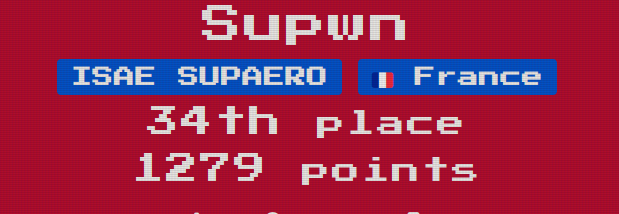
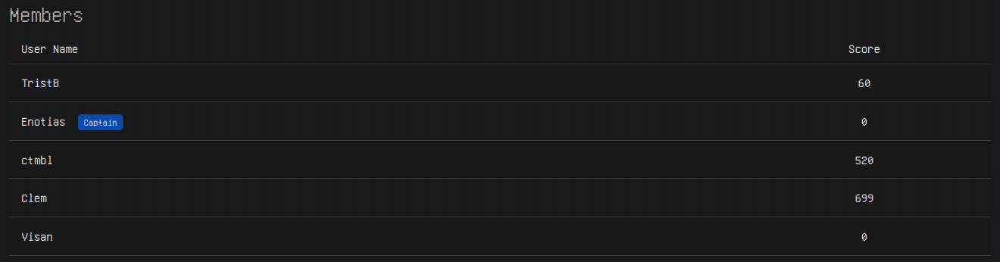

# THCon 2024
## About
The [THCon](https://thcon.party/), which stands for Toulouse Hacking Convention, is organized by a team of professionals, students and researchers from all over France, in Toulouse, France.  
It's first of all a 2-day convention on Thursday and Friday, where you can follow a good number of rumps and keynotes from professionals and researchers. A CTF follows on Saturday.

## Specs
2024 was the 3rd edition of the THCon **CTF**.  
It's a team, online **and** onsite, Jeopardy CTF and the flag format is `^THCON{.+}$`, the main categories are Pwn, Reverse, Network and Steganography.

## Our team
I compete this year with the `Supwn` student team from `SupAero`.  
We made the **18th place** over 32 teams onsite, and 24 over 130 teams online (at 6PM the end of the onsite CTF, the remote continued during the night).

## Links
**THCon Website**: https://thcon.party  
**THCon CTF**: https://ctf.thcon.party
**Discord**: https://discord.com/invite/DvDjQAHNaH
**Write ups**: *in the `writeups` [channel](https://discordapp.com/channels/817478318865121382/1226135501862473738) of their discord*  
